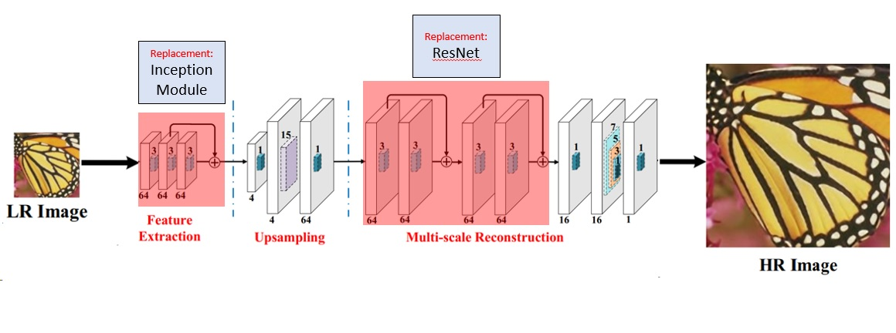
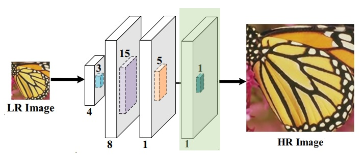
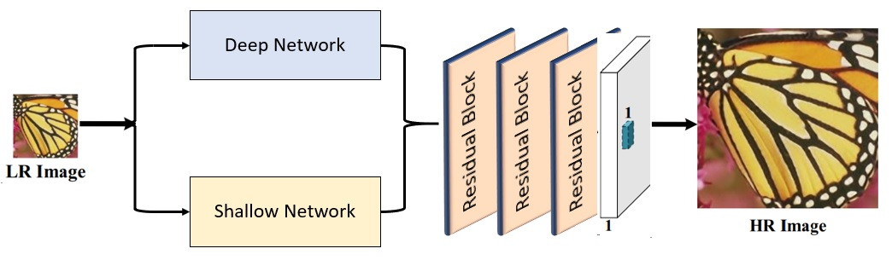

# Super Resolution using Deep and Shallow Networks
Based on End-to-End Image Super-Resolution via Deep and Shallow Convolutional Networks [1]

The concept of using deep and shallow networks is extracting high-frequency features and low-frequency features which are useful for reconstruction. This project revised the previously implemented network with modifications on feature extraction and reconstruction layers. The network is only trained and tested on 4x scaling scenarios

## Requirements
- python 3.6
- keras 2 with tensorflow

## Quick Sample
Produce images from the three networks from the Set14 folder
```python
python predict.py # chooses an image from Set14 folder
```

### Data 
#### Training
[DIV2K](https://data.vision.ee.ethz.ch/cvl/DIV2K/) dataset from [3] should be downloaded
```python
python create_data.py
```
**24000** train data and **3000** validation data for DIV2K is created

#### Test
Common datasets used for benchmarking are [**Set5**](https://uofi.box.com/shared/static/kfahv87nfe8ax910l85dksyl2q212voc.zip), [**Set14**](https://uofi.box.com/shared/static/igsnfieh4lz68l926l8xbklwsnnk8we9.zip) and [**BSD100**](https://uofi.box.com/shared/static/qgctsplb8txrksm9to9x01zfa4m61ngq.zip). The following datasets are obtained in https://github.com/jbhuang0604/SelfExSR. 


## Networks
***NOTE:*** Training for the networks with deep architecture takes 4 hrs for 150 epochs
            *_train.py starts from a current checkpoint. **BUT** replaces current weights in same folder which is used in testing

***NOTE:*** Testing is done per image where the network upscales (x4) the input low resolution image


## Deep Network (EED)
For the deep network, similar network architecture is implemented with modifications on feature extraction and reconstruction. A linear activation layer is inserted to map the reconstruction to the HR image. 


to **train** and **test** the data on deep network
```python
python eed_train.py
```
```python
python eed_test.py # tested on Set14 images
```

## Shallow Network (EES)
The shallow network is improved by inserting a last convolution layer with a linear activation.


to **train** and **test** the data on shallow network
```python
python ees_train.py
```
```python
python ees_test.py # tested on Set14 images
```

## Deep and Shallow Network (EEDS)
Before combining both networks, the last linear activation layer is removed. The network is then followed by three residual block with an architecture as [2].


to **train** and **test** the data on deep and shallow network
```python
python eeds_train.py
```
```python
python eeds_test.py # tested on Set14 images
```

## Results
Analysis is measured using PSNR (peak signal-to-noise ratio dB) and SSIM (structural similarity index) (notation: PSNR **/** SSIM). The **average** of all the images is computed. Comparison to other methods are done by evaluating the images previously reconstructed in https://github.com/jbhuang0604/SelfExSR.

|  Dataset   | EED | EES | EEDS |Bicubic  | Nearest  |  ScSR    | SelfExSR | SRCNN  | A+ | 
|:----------:|:----------:|:------------------:|:--------------:|:------------:|:---------:|:----------:|:-------:|:----------:|:----------:|
| **Set5**   |  26.79 **/** 0.807 |   26.147 **/** 0.778	| 25.443 **/** 0.753 | 27.106 **/** 0.79	|   24.988 **/** 0.715	 |   27.738 **/** 0.808	| 28.93 **/** 0.847	|   28.69 **/** 0.835	|       --	      |    
||
| **Set14**  |  23.92 **/** 0.691	|   23.476 **/** 0.674	| 19.99 **/** 0.645 |24.54 **/** 0.68	|   23.24 **/** 0.63	 |   24.98 **/** 0.702	| 26.014 **/** 0.735	|   25.596 **/** 0.72	|       --        	|  
||
| **BSD100** |  23.88 **/** 0.652 |   23.687 **/** 0.645	| 23.3378 **/** 0.639 |  24.658 **/** 0.645	|  23.74 **/** 0.606	 |   25.295 **/** 0.677	| 25.547 **/** 0.692	|   25.382 **/** 0.68	|   19.732 **/** 0.676	|    

The combined network results to poor results which may be caused by not fully optimizing the final layers after addition.

# References
[1] [End-to-End Image Super-Resolution via Deep and Shallow Convolutional Networks](https://arxiv.org/abs/1607.07680)

[2] [Enhanced Deep Residual Networks for Single Image Super-Resolution](https://arxiv.org/abs/1707.02921)

[3] [NTIRE 2017 Challenge on Single Image Super-Resolution: Methods and Results](http://personal.ie.cuhk.edu.hk/~ccloy/files/cvprw_2017_ntire.pdf)
